# Informe_Tarea_3

Integrantes: Chachalo Mayerli, Mensias Adrian, Robalino Johanna, Vallejo Keily 

## 1. OBJETIVOS 

Entender las bases y conceptos sobre los circuitos en serie y los circuitos en paralelo con el fin de tener claro como funcionan estos tipos de circuitos.

Aplicar la ley de corriente de Kirchoff para conocer las corrientes desconocidas en un circuito, identificar y calcular los efectos de carga de un voltimetro conectado a un circuito.

## 2. MARCO TEÓRICO 

## 3. EXPLICACIÓN Y RESOLUCIÓN DE EJERCICIOS O PROBLEMAS

EJERCICIOS CAPÍTULO 5 

EJERCICIOS CAPÍTULO 5 

1.	Los voltímetros de la figura 5-44 tienen autopolaridad. Determine la lectura de cada medidor, con la magnitud y el signo correctos.

2.  Los voltímetros de la figura 5-45 tienen autopolaridad. Determine la lectura de cada medidor, con la magnitud y el signo correctos. 

3.  Todos los resistores de la figura 5-46 son de 15Ω . Determine para cada caso la magnitud y la polaridad del voltaje V.

4.  El amperímetro de la figura 5-47 tiene autopolaridad. Determine sus lecturas,de la magnitud y el signo correctos.

5-2 Ley de voltaje de Kirchhoff

5.	Determine los voltajes desconocidos en las redes de la figura 5-48.

6.	Determine los voltajes desconocidos en las redes de la figura 5-49.

7.	Resuelva para hallar los voltajes desconocidos en el circuito de la figura 5-50.

5-3  Resistores en serie

8.	Resuelva para hallar los voltajes desconocidos en el circuito de la figura 5-51.

9.	Determine la resistencia total de las redes que se muestran en la figura 5-52.

10.	Determine las resistencias desconocidas en cada una de las redes que se muestran en la figura 5-53.

11.	Para cada uno de los circuitos de la figura 5-54, determine la resistencia total, RT, y la corriente I.

12.	Para los circuitos de la figura 5-55 tienen resistencia total, RT, como se muestra. Para cada circuito encuentre lo siguiente:

  

  a.	La magnitud de la corriente en el circuito.

  

  b.	El total de potencia suministrada por la fuente de voltaje.

  

  d.	El valor de la resistencia desconocida, R.

  

  e.	La caída de voltaje en cada resistor.

  

  f.	La potencia disipada por cada resistor. Verifique que la suma de potencias disipadas por los resistores sea igual a la potencia suministrada por la fuente de voltaje.

  
  
13.	Para el circuito de la figura 5-56 encuentre las siguientes cantidades:

  a.	La corriente del circuito.
  
  
  
  b.	La resistencia total.
  
  
  
  c.	El valor de la resistencia desconocida, R.
  
  
  
  d.	La caída de voltaje en todos los resistores en el circuito.
  
  
  
  e.	La potencia disipada por todos los resistores.
  
  
  
14.	El circuito de la figura 5-57 tiene una corriente de 2.5 mA. Encuentre las siguientes cantidades:

  a.	La resistencia total en el circuito.
  
  
  
  b.	El valor de la resistencia desconocida, R2.
  
  
  
  c.	La caída de voltaje en cada resistor en el circuito.
  
  
  
  d.	La potencia disipada por cada uno de los resistores.
  
  
  
15.	Para el circuito de la figura 5-58, encuentre las siguientes cantidades:

  a.	La corriente, I.
  
  
  
  b.	La caída de voltaje en cada resistor en el circuito.
  
  
  
  c.	El voltaje en las terminales abiertas a y b.
  
  
  
16.	Vea el circuito de la figura 5-59:

  a.	Utilice la ley de voltaje de Kirchhoff para encontrar las caídas de voltaje en R2 y R3.
  
  
  
  b.	Determine la magnitud de la corriente, I.

    I = 0.02 A = 20 mA

  c.	Encuentre la resistencia desconocida, R1.

  
	
17.	Repita el problema 16 para el circuito de la figura 5-60.

  a.	Utilice la ley de voltaje de Kirchhoff para encontrar las caídas de voltaje en R2 y R3.
  
  

  b.	Determine la magnitud de la corriente, I.

    I = 1.02409 mA

  c.	Encuentre la resistencia desconocida, R1.

  
	
18.	Vea el circuito de la figura 5-61:

  a.	Encuentre RT.

  

  b.	Resuelva para hallar la corriente, I.

  

  c.	Determine la caída de voltaje en cada resistor.

  

  d.	Verifique la Ley de voltaje de Kirchhoff alrededor del lazo cerrado.

  

  e.	Encuentre la potencia disipada por cada resistor.

  

  f.	Muestre que la potencia suministrada por la fuente de voltaje es igual a la suma de las potencias disipadas por los resistores.

    Pt = 180*7.73 = 1391.4 mW

19.	Repita el problema 18 para el circuito de la figura 5-62.

  a.	Encuentre RT.

  

  b.	Resuelva para hallar la corriente, I.

  

  c.	Verifique la Ley de voltaje de Kirchhoff alrededor del lazo cerrado.

  

  d.	Determine la caída de voltaje en cada resistor.

  

  e.	Encuentre la potencia disipada por cada resistor.

  

  f.	Muestre que la potencia suministrada por la fuente de voltaje es igual a la suma de las potencias disipadas por los resistores.

  

20.	Vea el circuito de la figura 5-63.

  a.	Calcule el voltaje en cada resistor.

  

  b.	Determine los valores de los resistores R1 y R2.

  

  c.	Encuentre la potencia disipada por cada uno de los resistores.

  

21.	Vuelva a dibujar los circuitos de la figura 5-64 para mostrar una sola fuente de voltaje para cada circuito. Encuentre la corriente para cada circuito.

22.	Utilice la información dada para determinar la polaridad y la magnitud de la fuente de voltaje desconocida en cada uno de los circuitos de la figura 5-65.

23.	Utilice la regla del divisor de voltaje para determinar el voltaje en cada resistor en los circuitos de la figura 5-66. Use sus resultados para verificar la ley de voltaje de Kirchhoff para cada circuito.

24.	Repita el problema 23 para los circuitos de la figura 5-67.

25.	 Vea los circuitos de la figura 5-68:

  a.  Encuentre los valores de los resistores desconocidos.
  b.  Calcule el voltaje en cada resistor.
  c.  Determine la potencia disipada por cada resistor.

  

  

  

  

  

  

26.	Vea los circuitos de la figura 5-69:

  a. Use la regla del divisor de voltaje para encontrar los valores de los resistores desconocidos.
  b. Calcule el voltaje en R1 y R3.
  c. Determine la potencia disipada por cada resistor.

  

  

  

  

  

  

27.	Una serie de focos se conecta a una fuente de 120 V como se muestra en la figura 5-70.

  a. Determine la corriente en el circuito.

  b. Utilice la regla del divisor de voltaje para encontrar el voltaje en cada foco.

  c. Calcule la potencia disipada por cada foco. 

  d. Si un solo foco llegara a estar en circuito abierto, la serie entera dejaría de funcionar. Para prevenir que ello ocurra, cada foco tiene una pequeña cinta de metal que pone en corto al foco cuando el filamento falla. Repita los pasos (a) a (c), si dos focos de la serie se quemaran.

  

  e. Basado en sus cálculos del paso (d), ¿qué cree que pasaría con la esperanza de vida del resto de los focos, si los dos que fallan no fueran reemplazados?

      La vida útil de los focos disminuye

28.	Repita el problema 27 con una serie de 36 focos.

  a. Determine la corriente en el circuito.

  b. Utilice la regla del divisor de voltaje para encontrar el voltaje en cada foco.

  c. Calcule la potencia disipada por cada foco. 

  d. Si un solo foco llegara a estar en circuito abierto, la serie entera dejaría de funcionar. Para prevenir que ello ocurra, cada foco tiene una pequeña cinta de metal que pone en corto al foco cuando el filamento falla. Repita los pasos (a) a (c), si dos focos de la serie se quemaran.

  

  e. Basado en sus cálculos del paso (d), ¿qué cree que pasaría con la esperanza de vida del resto de los focos, si los dos que fallan no fueran reemplazados?

      La vida útil de los focos disminuye

29.	Resuelva para hallar los voltajes V_ab y V_bc en los circuitos de la figura 5-68.

30. Repita el problema 29 para los circuitos de la figura 5-69.

31.	Para los circuitos de la figura 5-71, determine el voltaje en cada resistor y calcule el voltaje Va.

32.	Dados los circuitos de la figura 5-72:

  a. Determine el voltaje en cada resistor.

  b. Encuentre la magnitud y dirección de la corriente en un resistor de 180kohm. 

  c. Resuelva para hallar el voltaje Va.

  

33.	Se mide el voltaje en una batería que tiene un voltaje de terminales abiertas de 14.2 V. Cuando se conecta a una carga de 100 ohm, el voltaje medido entre las terminales de la batería cae a 6.8 V. a. Determine la resistencia interna de la batería b. Si la carga de 100ohm fuera reemplazada con una de 200ohm, ¿qué voltaje se mediría en las terminales de la batería?

34.	La fuente de voltaje que se muestra en la figura 5-73 tiene un voltaje a circuito abierto de 24 V. Cuando se conecta una carga de 10 ohm en las terminales, el voltaje medido con un voltímetro cae a 22.8 V. a. Determine la resistencia interna de la fuente de voltaje. b. Si la fuente sólo tuviera la mitad de la resistencia determinada en (a), ¿qué voltaje se mediría en las terminales si se conectara un resistor de 10 ohm?

35.	Para los circuitos en serie de la figura 5-74, determine la corriente en cada circuito. Si un amperímetro que tiene una resistencia interna de 50 ohm se usa para medir la corriente en los circuitos, determine la corriente a través de él y calcule el efecto de carga en cada circuito.

36.	Repita el problema 35 si el amperímetro tiene una resistencia de 10 ohm.

EJERCICIOS CAPÍTULO 6

6-5 Regla del divisor de corriente

29. Utilice la regla del divisor de corriente para encontrar las corrientes I1 e I2 en las redes de la figura 6-71.

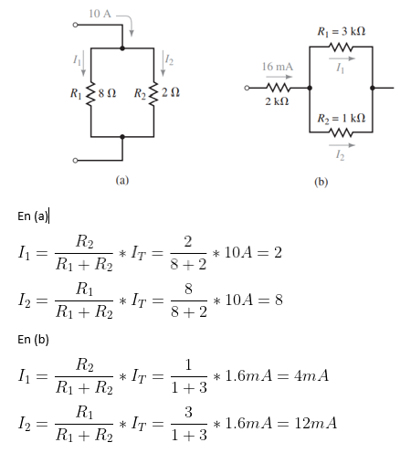

31. Utilice la regla del divisor de corriente para determinar todas las corrientes desconocidas en las redes de la figura 6-73.

33. Utilice la regla del divisor de corriente para determinar las resistencias desconocidas en la red de la figura 6-75.

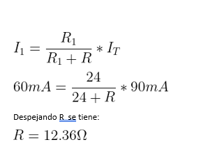

35. Vea el circuito de la figura 6-77: 
a. Determine la resistencia equivalente RT, del circuito. 
b. Encuentre la corriente I. 
c. Use la regla del divisor de corriente para determinar la corriente en cada resistor. 
d. Verifique la ley de corriente de Kirchhoff en el nodo a.

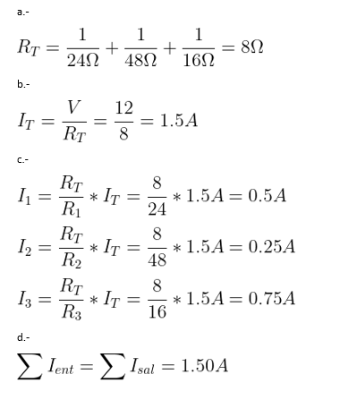

37. Vea el circuito de la figura 6-79. 
a. Encuentre la resistencia total RT y la corriente a través de la fuente de voltaje. 
b. Encuentre todas las corrientes desconocidas en el circuito. 
c. Verifique la ley de corriente de Kirchhoff en el nodo a. 
d. Determine la potencia disipada por cada resistor. Verifique que la potencia total disipada por los resistores es igual a la potencia suministrada por la fuente de voltaje.

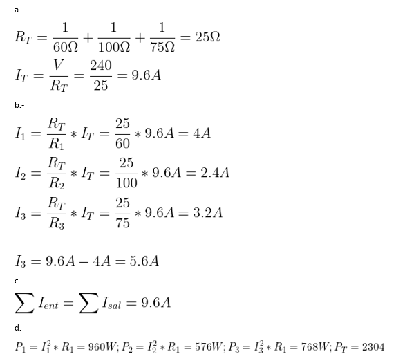

39. Vea el circuito de la figura 6-81: 
a. Calcule la corriente a través de cada resistor en el circuito. 
b. Determine la corriente total suministrada por la fuente de voltaje. 
c. Encuentre la potencia disipada por cada resistor.

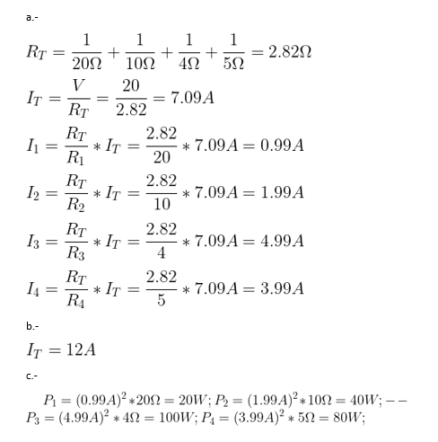

41. En el circuito de la figura 6-83
a.	Determine los valores de todos los resistores.
b.	Calcule las corrientes a través de R1, R2 y R4.
c.	Encuentre las corrientes I1 e I2.
d.	Encuentre la potencia disipada por los resistores R2, R3 y R4.

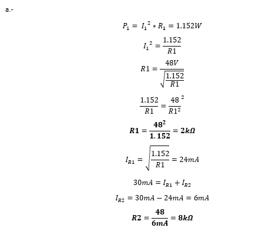

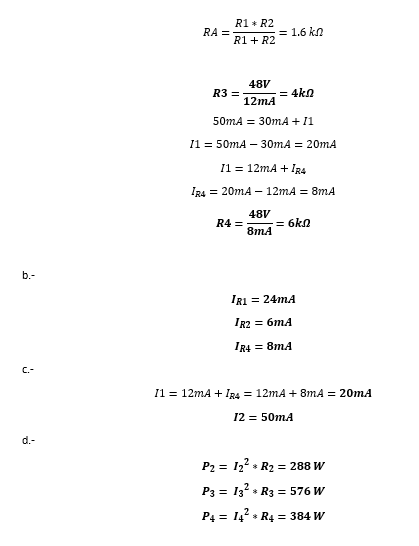

43. Para el circuito de la figura 6-85 determine cada una de las corrientes indicadas. Si el circuito tiene un fusible de 15 A, como se muestra, ¿la corriente es suficiente para hacer que el fusible se abra?

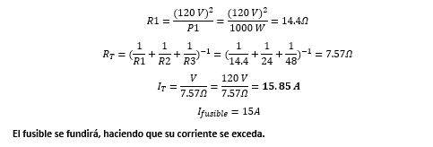

6.7 Efectos de carga en el voltímetro

45. Un voltímetro con una resistencia interna de 1 M se usa para medir el voltaje que se indica en el circuito de la figura 6-86. 
a. Determine la lectura de voltaje que indicará el medidor. 
b. Calcule el efecto.

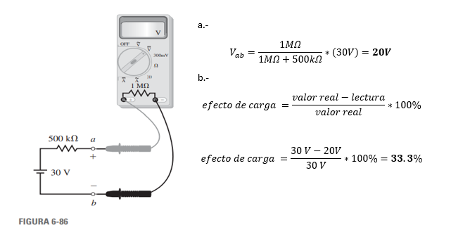

47. Un voltímetro analógico barato se usa para medir el voltaje en las terminales a y b en el circuito de la figura 6-87. Si el voltímetro indica que el voltaje Vab 1.2 V, ¿cuál es el voltaje real de la fuente si la resistencia del medidor es de 50 kΩ?

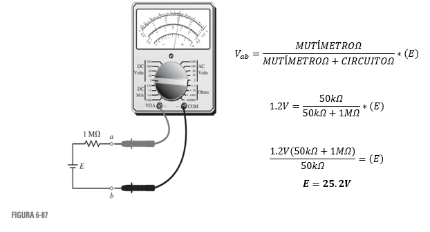

6-8 Análisis por computadora

49. Utilice Multisim para encontrar la corriente a través de cada resistor en el circuito de la figura 6-79

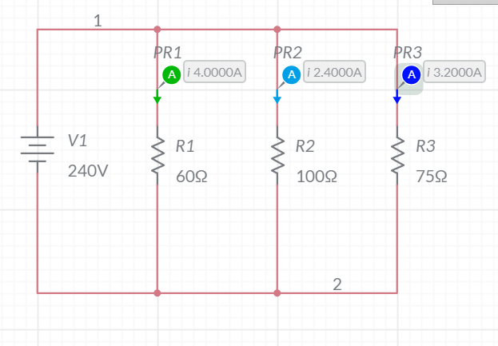

51. Utilice Multisim para simular un voltímetro con una resistencia interna de 1 M, como se muestra en la figura 6-86.

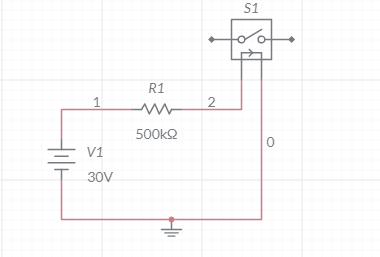

## 4. VIDEO

## 5. CONCLUSIONES 

Se concluye que los circuitos en serie son totalmente distintos a los circuitos en paralelo, ya que en los circuitos en serie existe una intensidad constante en cada componente y el voltaje se divide entre ellos mientras que en los circuitos en paralelo la intensidad de corriente es la que se divide y el voltaje es el que se mantiene constante en cada componente.

## 6. BIBLIOGRAFÍA
