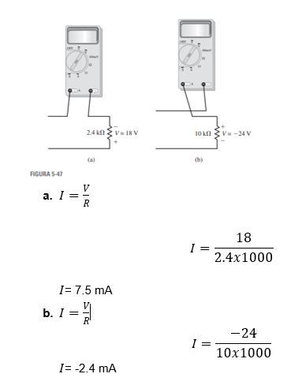
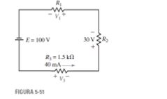

# Informe_Tarea_3

Integrantes: Chachalo Mayerli, Mensias Adrian, Robalino Johanna, Vallejo Keily 

## 1. OBJETIVOS 

## 2. MARCO TEÓRICO 

## 3. EXPLICACIÓN Y RESOLUCIÓN DE EJERCICIOS O PROBLEMAS

EJERCICIOS CAPÍTULO 5 

1)	Los voltímetros de la figura 5-44 tienen autopolaridad. Determine la lectura de cada medidor, con la magnitud y el signo correctos.

   
    
    a.	V=IxR
    
    V= 3Ax10Ω
    
    V= 30v
    
    b.	V=IxR
    
    V=-6Ax15Ω
    
    V= -90v
       
2)	Los voltímetros de la figura 5-45 tienen autopolaridad. Determine la lectura de cada medidor, con la magnitud y el signo correctos.

 
 
a.	V=IxR

V= -2Ax36Ω

V= - 72 v

b.	V=IxR

V= 4Ax40Ω

V=160 v

3)	Todos los resistores de la figura 5-46 son de 15Ω . Determine para cada caso la magnitud y la polaridad del voltaje V.

 

a.	V=IxR

V=3Ax15Ω

V=45v

b.	V=IxR

V= -4Ax15Ω

V=-60v

c.	V=IxR

V= 6Ax15Ω

V=90v

d.	V=IxR

V= -7Ax15Ω

V= -105 v

4)	El amperímetro de la figura 5-47 tiene autopolaridad. Determine sus lecturas,de la magnitud y el signo correctos.

 
 
 5-2 Ley de voltaje de Kirchhoff
 
5)	Determine los voltajes desconocidos en las redes de la figura 5-48.

 

6)	Determine los voltajes desconocidos en las redes de la figura 5-49.

 
 
 a.	V2= IxR 
 
V2=2A*2Ω

V2= 4V

16V-2V-V1-4V=0

16V-6V=V1

V1=10V

V3=2V+10V+4V=16V

V3=16V=16V

V3=16V

b.	-V2-6V-2V=0

V2=4V 

V1= 40w/4A

V1=10V

V3-10V+4V=0

V3=6V

7)	Resuelva para hallar los voltajes desconocidos en el circuito de la figura 5-50.

 

V3= 36w/3A

V3=12V

24V-10V-12V-V2=0

24V-22V=V2

V2=2V

8)	Resuelva para hallar los voltajes desconocidos en el circuito de la figura 5-51.

5-3  Resistores en serie

V3=1.5 kΩ x40 mA =60V

100V-60V-30V-V1=0

V1=10V

9)	Determine la resistencia total de las redes que se muestran en la figura 5-52.

10)	Determine las resistencias desconocidas en cada una de las redes que se muestran en la figura 5-53.

a.	Rt = 10Ω+22Ω+47Ω+15Ω

Rt = 95Ω

b.	Rt = 12000Ω+12000Ω+12000Ω

Rt = 36kΩ

c.	Rt = 2R2+R2+6R2

36Ω=9R2

R2= 4Ω

R1=2R2

R1=2x(4Ω)

R1=8Ω

R3= 3R1

R3=6R2

R3=6x(4Ω)

R3= 24Ω

11)	Para cada uno de los circuitos de la figura 5-54, determine la resistencia total, RT, y la corriente I.

12)	Para los circuitos de la figura 5-55 tienen resistencia total, RT, como se muestra. Para cada circuito encuentre lo siguiente:

a.	La magnitud de la corriente en el circuito.

I = E/R

I = 90/12

I = 7.5V    

b.	El total de potencia suministrada por la fuente de voltaje.

Pt = E*I

Pt = 90*7.5

Pt = 675w

c.	La dirección de la corriente a través de cada resistor en el circuito.

La resistencia se daría en sentido horario.

d.	El valor de la resistencia desconocida, R.

Rt = R1+R2+R3+R4

R4 = Rt-R1-R2-R3

R4 = 12kΩ-1kΩ-4kΩ-3kΩ

R4 = 4kΩ

e.	La caída de voltaje en cada resistor.

V1 = 7.5*1 = 7.5V

V2 = 7.5*4 = 30V

V3 = 7.5*3 = 22.5V

V4 = 7.5*4 = 30V

f.	La potencia disipada por cada resistor. Verifique que la suma de potencias disipadas por los resistores sea igual a la potencia suministrada por la fuente de voltaje.

P1 = (7.5)^2 * (1kΩ) = 56.25w

P2 = (7.5)^2 * (4kΩ) = 225w

P3 = (7.5)^2 * (3kΩ) = 168.75w

P4 = (7.5)^2 * (4kΩ) = 225w

Pt = 56.25w+225+168.75+225w

Pt = 675w

13)	Para el circuito de la figura 5-56 encuentre las siguientes cantidades:

14)	El circuito de la figura 5-57 tiene una corriente de 2.5 mA. Encuentre las siguientes cantidades:

La resistencia total en el circuito.

RT=E/I

RT=45V/2.5mA

RT=18 kΩ

El valor de la resistencia desconocida, R2.

RT=R1+R2+R3

18 kΩ=3.3kΩ+R2+5.6kΩ

R2=18-8.9

R2=9.1Ω

La caída de voltaje en cada resistor en el circuito.

VR1=2.5mA x 3.3kΩ

VR1=8.25V

VR2=2.5mA x 9.1kΩ

VR2=22.75V

VR3=2.5mA x 5.6kΩ

VR3=14V

La potencia disipada por cada uno de los resistores.

PR1=(2.5mA)2 x 3.3kΩ

PR1= 20.625mW

PR2=(2.5mA)2 x 9.1kΩ

PR2= 56.875mW

PR3=(2.5mA)2 x 5.6kΩ

PR3=35mW

15)	Para el circuito de la figura 5-58, encuentre las siguientes cantidades:

16)	Vea el circuito de la figura 5-59:

17)	Repita el problema 16 para el circuito de la figura 5-60.

a.	Utilice la ley de voltaje de Kirchhoff para encontrar las caídas de voltaje en R2 y R3.

∑V=0

16V-7.5V-(Ix4.7kΩ)-(Ix3.6kΩ)

8.5V-8.3kI=0

I= -8.5/-8.3

I=1.02409mA

VR2=IxR

VR2=1.02409mAx4.7kΩ

VR2=4.81325v

VR3=IxR

VR3=1.02409mAx3.6kΩ

VR3=3.68675v

b.	Determine la magnitud de la corriente, I.

I=1.02409mA

c.	Encuentre la resistencia desconocida, R1.

R1= VR1/I
  
R1= 7.5V/1.02409mA

R1= 7.32352kΩ
  
18)	Vea el circuito de la figura 5-61:

a.	Encuentre RT.

Rt = 1.8kΩ+3.3kΩ+10kΩ+8.2kΩ

Rt = 23.3

b.	Resuelva para hallar la corriente, I.

I = 180/23.3

I = 7.73V

c.	Determine la caída de voltaje en cada resistor.

V1 = 7.73*1.8 = 13.91

V2 = 7.73*3.3 = 25.50

V3 = 7.73*10 = 77.3

V4 = 7.73*8.2 = 63.386

d.	Verifique la Ley de voltaje de Kirchhoff alrededor del lazo cerrado.

∑V=0

180V-13.91V-25.5V-77.3V-63.386V=0

0=0
e.	Encuentre la potencia disipada por cada resistor.

P1 = (7.73)^2*1.8= 107.55mw

P2 = (7.73)^2*3.3= 197.18mw 

P3 = (7.73)^2*10= 597.52mw 

P4 = (7.73)^2*8.2= 489.97mw 

f.	Muestre que la potencia suministrada por la fuente de voltaje es igual a la suma de las potencias disipadas por los resistores.

Pt = 180*7.73= 1391.4mW

## 4. VIDEO

## 5. CONCLUSIONES 

## 6. BIBLIOGRAFÍA
