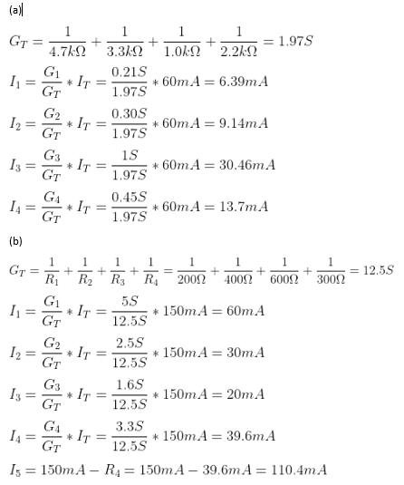

# Informe_Tarea_3

Integrantes: Chachalo Mayerli, Mensias Adrian, Robalino Johanna, Vallejo Keily 

## 1. OBJETIVOS 

## 2. MARCO TEÓRICO 

## 3. EXPLICACIÓN Y RESOLUCIÓN DE EJERCICIOS O PROBLEMAS

EJERCICIOS CAPÍTULO 5 

1)	Los voltímetros de la figura 5-44 tienen autopolaridad. Determine la lectura de cada medidor, con la magnitud y el signo correctos.

EJERCICIOS CAPÍTULO 6

6-5 Regla del divisor de corriente

29. Utilice la regla del divisor de corriente para encontrar las corrientes I1 e I2 en las redes de la figura 6-71.

31. Utilice la regla del divisor de corriente para determinar todas las corrientes desconocidas en las redes de la figura 6-73.

33. Utilice la regla del divisor de corriente para determinar las resistencias desconocidas en la red de la figura 6-75.

35. Vea el circuito de la figura 6-77: 
a. Determine la resistencia equivalente RT, del circuito. 
b. Encuentre la corriente I. 
c. Use la regla del divisor de corriente para determinar la corriente en cada resistor. 
d. Verifique la ley de corriente de Kirchhoff en el nodo a.

37. Vea el circuito de la figura 6-79. 
a. Encuentre la resistencia total RT y la corriente a través de la fuente de voltaje. 
b. Encuentre todas las corrientes desconocidas en el circuito. 
c. Verifique la ley de corriente de Kirchhoff en el nodo a. 
d. Determine la potencia disipada por cada resistor. Verifique que la potencia total disipada por los resistores es igual a la potencia suministrada por la fuente de voltaje.

39. Vea el circuito de la figura 6-81: 
a. Calcule la corriente a través de cada resistor en el circuito. 
b. Determine la corriente total suministrada por la fuente de voltaje. 
c. Encuentre la potencia disipada por cada resistor.

41. En el circuito de la figura 6-83
a.	Determine los valores de todos los resistores.
b.	Calcule las corrientes a través de R1, R2 y R4.
c.	Encuentre las corrientes I1 e I2.
d.	Encuentre la potencia disipada por los resistores R2, R3 y R4.

43. Para el circuito de la figura 6-85 determine cada una de las corrientes indicadas. Si el circuito tiene un fusible de 15 A, como se muestra, ¿la corriente es suficiente para hacer que el fusible se abra?

6.7 Efectos de carga en el voltímetro

45. Un voltímetro con una resistencia interna de 1 M se usa para medir el voltaje que se indica en el circuito de la figura 6-86. 
a. Determine la lectura de voltaje que indicará el medidor. 
b. Calcule el efecto.

47. Un voltímetro analógico barato se usa para medir el voltaje en las terminales a y b en el circuito de la figura 6-87. Si el voltímetro indica que el voltaje Vab 1.2 V, ¿cuál es el voltaje real de la fuente si la resistencia del medidor es de 50 kΩ?

6-8 Análisis por computadora

49. Utilice Multisim para encontrar la corriente a través de cada resistor en el circuito de la figura 6-79

51. Utilice Multisim para simular un voltímetro con una resistencia interna de 1 M, como se muestra en la figura 6-86.

## 4. VIDEO

## 5. CONCLUSIONES 

## 6. BIBLIOGRAFÍA
